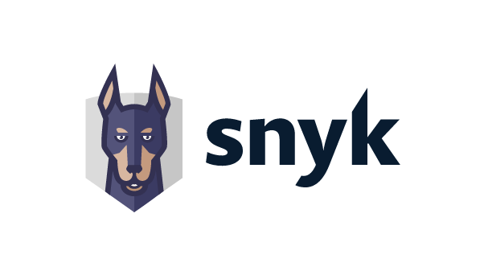
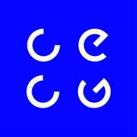
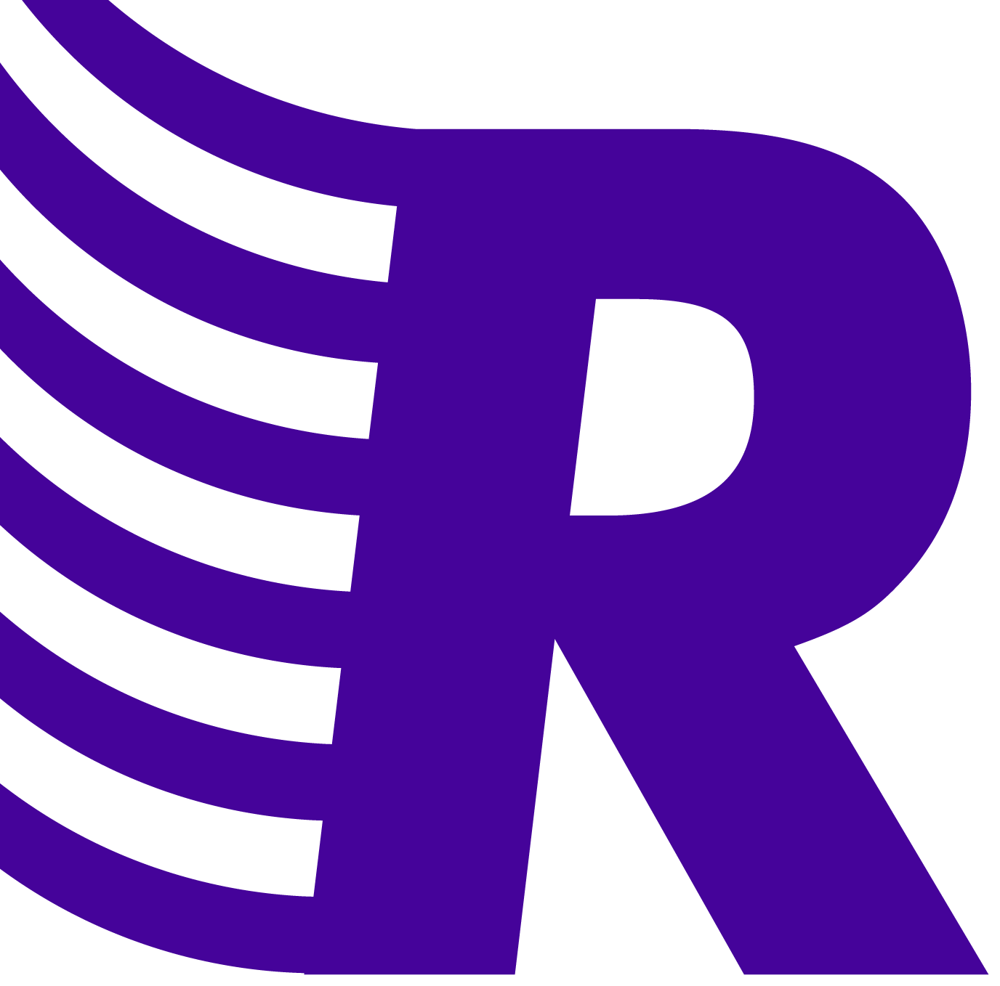
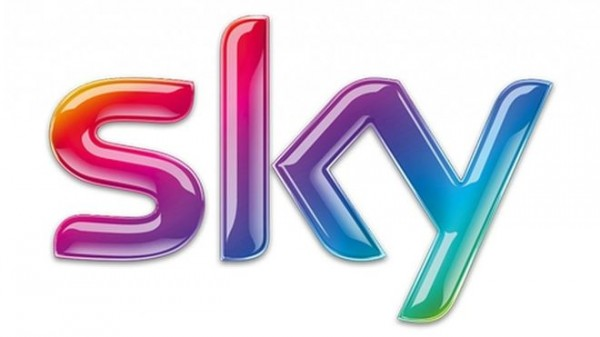
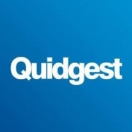
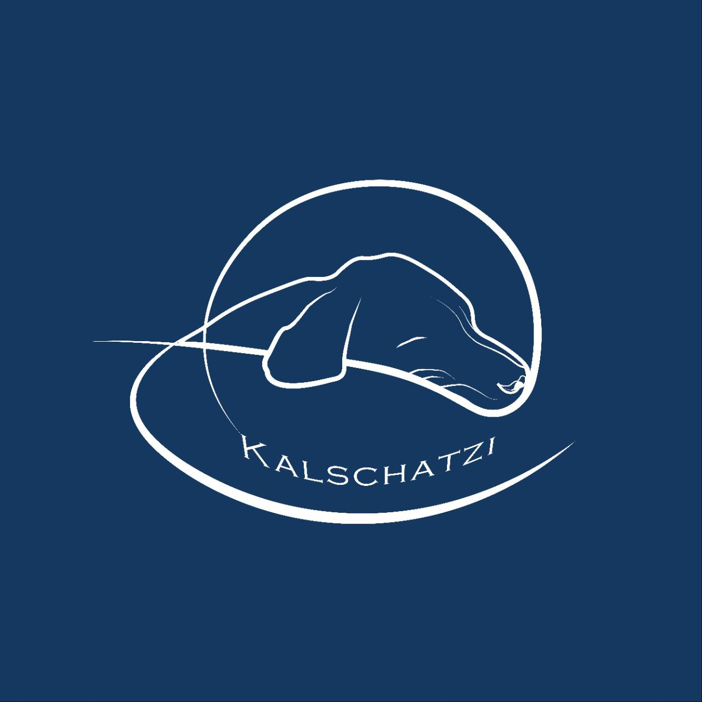

# Tiago Alves

\[[tiago@kalschatzi.com](mailto:tiago@kalschatzi.com)] • \[+351 915718324] • [LinkedIn](https://linkedin.com/in/tmcalves) • [GitHub](https://github.com/tmcalves) • [Website](https://learn.kalschatzi.com)

---

## 🧑‍💻 Summary

Staff Software Engineer specializing in AI-powered security tooling and Internal Developer Platforms. I lead the design of secure, large-scale systems — from autonomous AI security agents and hardened sandboxes to end-to-end developer platforms — across startups and enterprises like Snyk and Sky plc. Active mentor and teacher.

---

## 🛠️ Key Technical Skills

**Languages:** Java, Groovy, Golang, Flutter, Rust, Python

**DevOps:** Docker, Kubernetes, k3s, Nomad, GitHub Actions, Jenkins, Terraform, ArgoCD

**Cloud:** AWS, GCP

**Networking & Self-Hosting:** Tailscale, Cloudflare Tunnels, NFS

**Databases:** PostgreSQL, Cassandra, Redis

**Observability:** ELK, Prometheus, Grafana, Datadog

**AI & Security:** LLM agents & orchestration, autonomous agent sandboxing (bubblewrap, seccomp, egress policies), AppSec, penetration testing

**Other:** Apache Kafka, Gradle, Cilium, Envoy

---

## 💼 Experience

 • Snyk • **Staff Software Engineer**

*November 2025 – Present*

* Leading the design and development of an AI-powered penetration testing service for Snyk's platform.
* Architected a two-component system (API server + async worker) for orchestrating autonomous security assessments of web applications.
* Built a hardened sandbox execution environment using bubblewrap, seccomp, and network egress policies to safely run AI agents.
* Implemented async job processing via Redis Streams with idempotent ingestion and concurrency-safe writes.
* Tech stack: Go, Rust, Python, PostgreSQL, Redis, Docker, Kubernetes, Envoy

---

 • CECG • **Lead Software Engineer**

*November 2021 – October 2025*

* Led the development of Internal Developer Platforms for different clients.
* Strong focus on security; collaborated with the security team to design platform features.
* Built an out-of-the-box, fully containerized Developer Platform deployable in days, saving years of manual effort.
* Redesigned and helped rebuild the CMS solution for a major media company while improving department workflows.

---

 • Toptal • **Lead Software Engineer**

*February 2018 – January 2022 — freelance, alongside full-time roles*

Freelance software engineer through Toptal, taken on in parallel with my full-time positions. Worked across multiple client projects:

**Client: Messaging and voicemail management mobile app**

* Designed and implemented UI based on mockups.
* Integrated features such as a messaging service and setup bot.
* Tech stack: Flutter, Dialogflow, Firebase Cloud Messaging, Google Charts

**Client: Aviation maintenance application**

* Led mobile development and managed a team of 4 engineers.
* Delivered full application based on design specs.
* Tech stack: Node.js, Flutter, GCP, Serverless

**Client: Reinsurance company**

* Backend engineer across legacy and new systems.
* Co-designed a modern service-oriented architecture.
* Tech stack: Nest.js, Serverless, AWS, Java, Spring Boot, PostgreSQL, TypeORM

---

 • Reachdesk • **Senior Software Engineer**

*January 2021 – October 2021*

* Fourth engineer at the company; helped scale to 40+ people.
* Focused on reliability and resilience of the platform.
* Built comprehensive test coverage (functional, integration, load).

---

 • Sky PLC • **Senior Software Engineer**

*January 2016 – December 2020*

* Built scalable and highly available REST APIs.
* Migrated legacy databases using custom tools (Pentaho).
* Created robust test suites across multiple test levels.
* Maintained CI/CD pipelines on Kubernetes for microservices.
* Tuned database and API performance; implemented zero-downtime optimizations.
* Built observability dashboards using Kibana and Grafana.
* Led and improved an internal Kubernetes-based PaaS.

---

 • Airnav Systems LLC • **Senior Software Engineer**

*February 2012 – December 2015*

* Developed and maintained all RadarBox24 applications using multiple APIs.
* Contributed to the development of the radarbox24.com website.
* Built RESTful services with Redis to optimize data access.
* Implemented a high-throughput Java data processing server.
* Developed Android apps for flight tracking.
* Created a Maven-based data processor feeding data to Redis for downstream apps.

---

 • Quidgest • **Software Developer**

*May 2011 – August 2011*

* Implemented PDF report generation.
* Contributed to the development of the code generator tool.
* Refactored and maintained old applications.

---

## 🧾 Online Writing / Public Contributions

* [MVP Security for a Bank Developer Platform](https://www.cecg.io/blog/security-for-mvp/)
* [Security for a Large International Media Provider's IDP](https://www.cecg.io/blog/case-study-security-media-providers-internal-developer-platform/)
* [Supporting GCP's Private Service Access](https://www.cecg.io/blog/intra-account-connectivity/)
* [Computer Network Fundamentals](https://learn.kalschatzi.com/module2/)
* [Java and OOP](https://learn.kalschatzi.com/module1/)

---

## 📂 Projects

**Market Analyser** – Self-hosted quantitative trading research platform

* End-to-end Go system for stock market research, backtesting, and paper trading via Interactive Brokers.
* Self-hosted on personal infrastructure: PostgreSQL, Grafana dashboards, IB Gateway containers, Jenkins CI/CD.
* Deployed with Docker Compose on NFS-backed storage; automated pipeline (lint, test, deploy, regression replay).
* Walk-forward validation, Monte Carlo confidence intervals, and an 8-gate promotion framework before any strategy goes live.
* Tech stack: Go, PostgreSQL, Docker, Jenkins, Grafana, NFS

---

 • **Kalschatzi's Learning Platform** – [GitHub](https://github.com/Kalschatzi) | [Site](https://learn.kalschatzi.com)

* Platform and content for a mentorship project supporting junior engineers.
* Currently mentoring 4 students.

---

## 🎓 Education

* **Universidade Nova de Lisboa - Master's in Computer Science** — *2011–2016*
* **Wrocław University of Science and Technology - Bachelor in Computer Science (ERASMUS program)** - *2013-2014*

---
